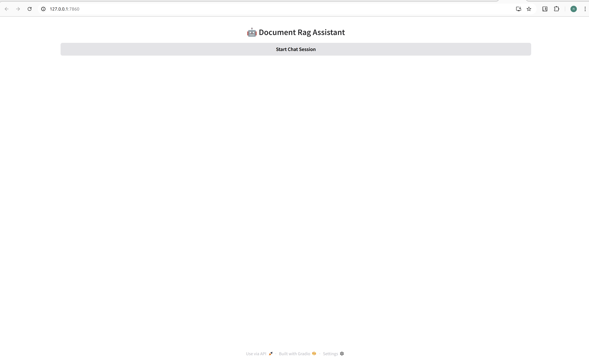
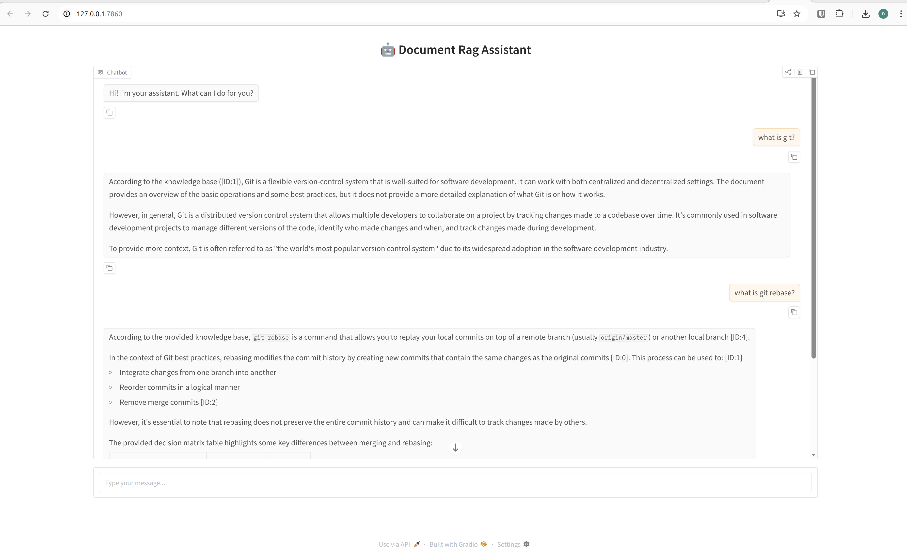

# Chatbot API for Document Query with RAGFlow

This project provides a **FastAPI**-based chatbot API that allows users to interact with documents (e.g., `git_best_practises_workflows.pdf`) using **RAGFlow**. The system uses **BGE-M3 embeddings** to encode the document and a **Llama model** to answer user queries.  

---

## Features

- Create a **chat session** with the chatbot
- Send **user queries** and receive answers
- Queries are answered based on a **specific document** using RAG (Retrieval-Augmented Generation)
- Supports single chat with multiple chat sessions for all users

---

## Architecture

- **RAGFlow SDK**: Handles document ingestion, embeddings, and query-answering
- **BGE-M3**: Used for embeddings of document content
- **Llama model**: Generates natural language answers
- **FastAPI**: Exposes REST endpoints for chat sessions and messaging
- **Pydantic models**: Request and response validation

---

## Endpoints

### 1️⃣ Create a Chat Session

**POST** `/session`

**Response:**

```json
{
  "session_id": "673234d0e59d11f091615228ce713ae0",
  "chatbot_greeting": "Hi! I'm your assistant. What can I do for you?"
}
```

### 2️⃣ Send a Chat Message
**POST** `/answer`

**Request:**

```json
{
  "session_id": "673234d0e59d11f091615228ce713ae0",
  "user_query": "How can I follow Git best practices?"
}
```
**Response:**

```json
{
  "answer": "To follow Git best practices, you should create feature branches, write descriptive commit messages, rebase instead of merging when appropriate..."
}
```

## UI Demonstration

### Step 1: Start Screen
1. User sees the chatbot title and the **Start Chat Session** button.
2. User asks a question, and the chatbot responds with an answer from the document.




## Configuration

Set environment variables:


- **API_KEY**: Your RAGFlow API key

- **RAGFLOW_BASE_URL**: Base URL for RAGFlow server

- **CHAT_NAME**: Name of the chat

## Notes

- The document must be ingested into RAGFlow for the chatbot to answer questions

- Embeddings are handled by BGE-M3, and answers are generated by Llama

- Multiple sessions can be active concurrently


## References

RAGFlow SDK: https://ragflow.io/